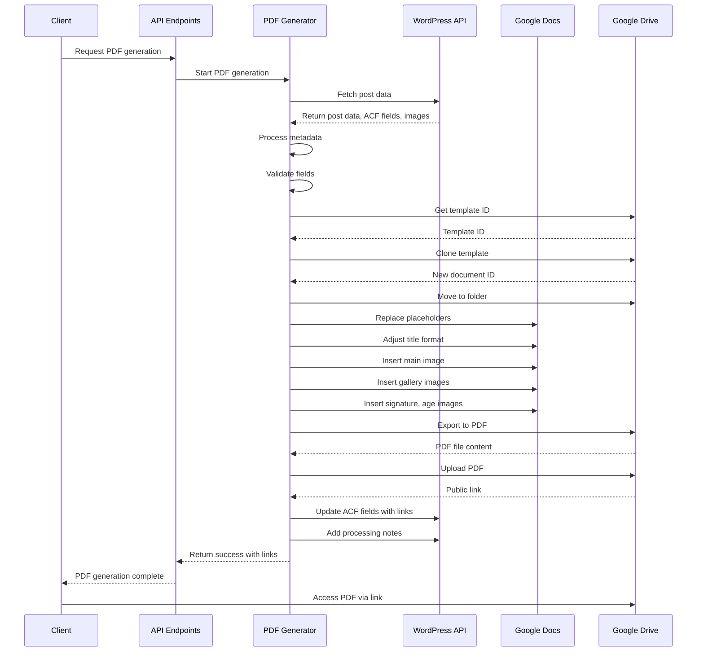
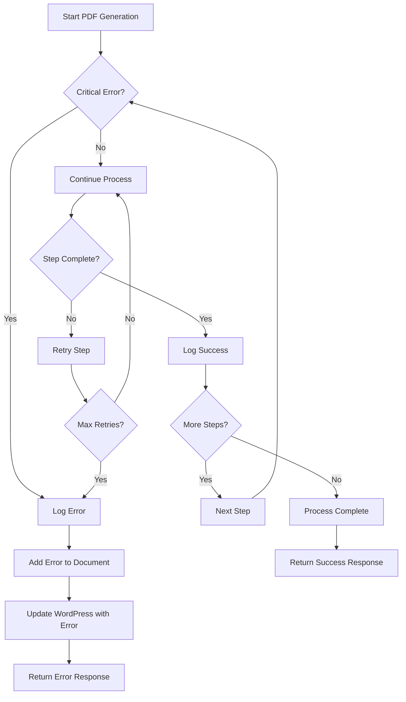
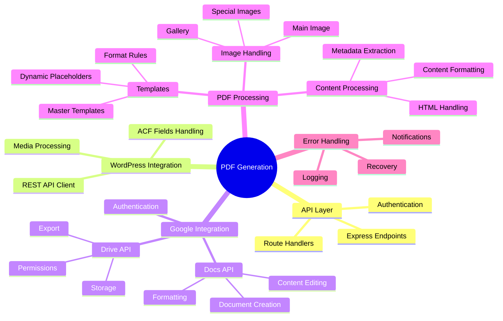

# PDF Generation Detailed Process Flow

This document provides a detailed technical flow of the PDF generation process, showing the interaction between different components and services.

## System Component Interaction

```mermaid
graph TB
    subgraph "Client Side"
        A[Client/Admin Request]
        Z[Download PDF]
    end
    
    subgraph "API Layer"
        B[Express API Endpoints]
        B1[/api/pdf/generate-pdf]
        B2[/api/pdf/generate-pdf-steps]
        B3[/api/pdf/steps]
        
        B --> B1
        B --> B2
        B --> B3
    end
    
    subgraph "WordPress Integration"
        C[WordPress API]
        C1[Post Data Retrieval]
        C2[ACF Field Updates]
        C3[Notes Updates]
        
        C --> C1
        C --> C2
        C --> C3
    end
    
    subgraph "Metadata Processing"
        D[Process Metadata]
        D1[Extract ACF Fields]
        D2[Decode HTML Entities]
        D3[Format Content]
        D4[Validate Required Fields]
        
        D --> D1
        D --> D2
        D --> D3
        D --> D4
    end
    
    subgraph "Google Integration"
        E[Google APIs]
        E1[Google Docs]
        E2[Google Drive]
        
        E --> E1
        E --> E2
        
        E1 --> E11[Create Document]
        E1 --> E12[Edit Content]
        E1 --> E13[Insert Images]
        
        E2 --> E21[Clone Template]
        E2 --> E22[Organize Files]
        E2 --> E23[Export PDF]
        E2 --> E24[Upload PDF]
    end
    
    subgraph "PDF Generation Steps"
        F[PDF Generation Process]
        F1[Fetch Post Data]
        F2[Process Metadata]
        F3[Get Template]
        F4[Clone Template]
        F5[Move to Folder]
        F6[Replace Placeholders]
        F7[Adjust Title]
        F8[Insert Main Image]
        F9[Insert Gallery]
        F10[Insert Specific Images]
        F11[Export PDF]
        F12[Upload PDF]
        F13[Update WordPress]
        
        F --> F1 --> F2 --> F3 --> F4 --> F5 --> F6 --> F7 --> F8 --> F9 --> F10 --> F11 --> F12 --> F13
    end
    
    subgraph "Error Handling"
        G[Error Mechanisms]
        G1[Step Logging]
        G2[Error Capture]
        G3[WordPress Error Notes]
        G4[Recovery Options]
        
        G --> G1
        G --> G2
        G --> G3
        G --> G4
    end
    
    A --> B
    B1 --> F
    C1 --> F1
    F2 --> D
    F3 --> E21
    F6 --> E12
    F8 --> E13
    F9 --> E13
    F10 --> E13
    F11 --> E23
    F12 --> E24
    F13 --> C2
    F13 --> C3
    F --> G
    F13 --> Z
```

## Detailed Data Flow



## Error Handling Flow



## System Components Map



This detailed flow provides a comprehensive visualization of the entire PDF generation process in the appraisals backend system. 