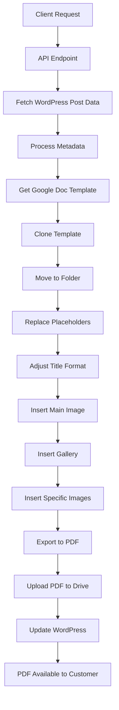

# PDF Generation Process in Appraisals Backend

## Overview

The PDF generation process in the appraisals backend transforms WordPress post data (appraisals) into professional, formatted PDF documents that can be shared with customers. This document explains the complete end-to-end process, from initiating a PDF generation request to the final delivery of a document to the customer.

## Process Flow

## Detailed Process Steps

### 1. Client Request Initiation
The process begins when a client or admin initiates a request to generate a PDF for a specific appraisal. This can happen through:
- API calls to the `/api/pdf/generate-pdf` endpoint
- Admin interface actions
- Automated processes triggered by appraisal status changes

### 2. API Endpoint Processing
The backend offers several endpoints for PDF generation:
- `POST /api/pdf/generate-pdf` - Main endpoint requiring a WordPress post ID
- `POST /api/pdf/generate-pdf-steps` - Advanced endpoint allowing step-by-step processing
- `GET /api/pdf/steps` - Returns available PDF generation steps

### 3. WordPress Data Retrieval
The system fetches all relevant data from the WordPress post that contains the appraisal information:
- Post title and date
- ACF (Advanced Custom Fields) data containing appraisal details
- Media attachments (main image, signature, age verification, etc.)
- Custom metadata for the appraisal

### 4. Metadata Processing
The raw WordPress data is processed into a structured format:
- Essential fields are extracted from ACF data
- HTML entities are decoded
- Images are processed into usable formats
- Validation is performed to ensure all required fields are present

### 5. Google Docs Template Retrieval
A master template is selected based on the appraisal type:
- Standard templates are stored as Google Docs in Drive
- Templates contain placeholders for dynamic content
- Template IDs are configured in the application

### 6. Template Cloning
The system creates a copy of the template for the specific appraisal:
- Uses Google Drive API to clone the document
- Sets a unique name based on the appraisal title and ID
- Preserves all formatting and structure from the template

### 7. File Organization
The newly created document is moved to the appropriate Google Drive folder:
- Organized by appraisal type or client
- Permissions are set to control access
- The document link is stored for later reference

### 8. Placeholder Replacement
The system replaces all placeholders in the document with actual content:
- Title, date, and reference information
- Appraisal details (condition, estimated age, creator, etc.)
- Valuation information and justification
- Technical details (dimensions, medium, etc.)
- Market analysis and comparables

### 9. Title Formatting
The document title is formatted for readability and professionalism:
- Font size is adjusted based on title length
- Formatting is applied for emphasis

### 10. Image Insertion
Various images are inserted into designated positions in the document:
- Main image of the appraised item
- Age verification images
- Signature or makers mark images
- Gallery of similar items or additional views

### 11. PDF Export
The completed Google Doc is exported to PDF format:
- Maintains all formatting and layout
- Ensures consistent appearance across devices
- Optimizes file size for sharing

### 12. PDF Storage
The PDF file is uploaded to Google Drive:
- Stored in a specific folder for appraisal PDFs
- Named with a consistent pattern including the appraisal ID
- Public sharing link is generated

### 13. WordPress Update
The WordPress post is updated with the PDF information:
- PDF link is stored in ACF fields
- Google Doc link is also stored for reference
- Processing notes are added to track the PDF generation

### 14. Client Delivery
The PDF is now available for customer access:
- Can be downloaded directly from WordPress
- May be emailed to the customer
- Available for admin reference

## Key Components

### Metadata Fields
The PDF includes a wide range of metadata fields from the WordPress post:
- `title`: The title of the appraised item
- `date`: Date of the appraisal
- `main`, `age`, `signature`: Images of the item
- `googlevision`: Similar items gallery
- `estimated_age`: Age determination
- `creator`: Artist or maker information
- `condition_summary`: Item condition assessment
- `value`: Final appraisal value
- And many more fields that provide comprehensive information

### Placeholders
The template uses a placeholder system to dynamically insert content:
- Format: `{{field_name}}`
- Examples: `{{title}}`, `{{value}}`, `{{condition_summary}}`
- Special container placeholders like `{{appraisal_card}}` and `{{statistics_section}}`

### Document Structure
The generated PDF follows a standardized professional format:
1. **Header**: Title, appraisal info, reference number
2. **Executive Summary**: Value and purpose
3. **Item Description**: Details, dimensions, age
4. **Condition Assessment**: Current state and issues
5. **Creator Profile**: Artist/maker information
6. **Valuation Analysis**: Market factors and methodology
7. **Conclusion**: Final determination and justification
8. **Market Research**: Comparable items and trends
9. **Images**: All supporting imagery
10. **Appraiser Information**: Credentials and disclaimer

## Error Handling and Resilience

The PDF generation process includes several error handling mechanisms:
- Non-critical steps will continue despite errors
- Critical errors will abort the process
- Error notes are added to documents when issues occur
- WordPress is updated with error information
- Each step is logged for diagnostic purposes

## Technical Implementation

The system uses various APIs and services:
- Google Docs API for document creation and editing
- Google Drive API for storage and organization
- WordPress API for fetching and updating post data
- Node.js for backend processing
- Express.js for API endpoints

## Configuration Options

The PDF generation can be customized through various options:
- Template selection based on appraisal type
- Starting from specific steps for debugging or resume
- Output format (Google Doc or PDF)
- Folder organization
- Filename patterns

## Monitoring and Logging

The process includes comprehensive logging:
- Each step is logged with timestamp
- Errors are captured with contextual information
- WordPress post is updated with processing notes
- Success/failure information is stored

## Future Enhancements

Planned improvements to the PDF generation process:
- Additional template options for different appraisal types
- Enhanced image processing and layout
- More customization options for client branding
- Performance optimizations for faster generation
- Better error recovery mechanisms

---

This document provides a comprehensive overview of the PDF generation process in the appraisals backend. For technical implementation details, refer to the source code in the related files. 