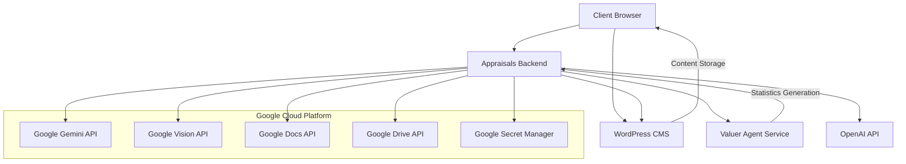
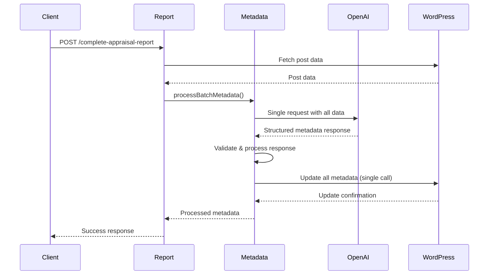
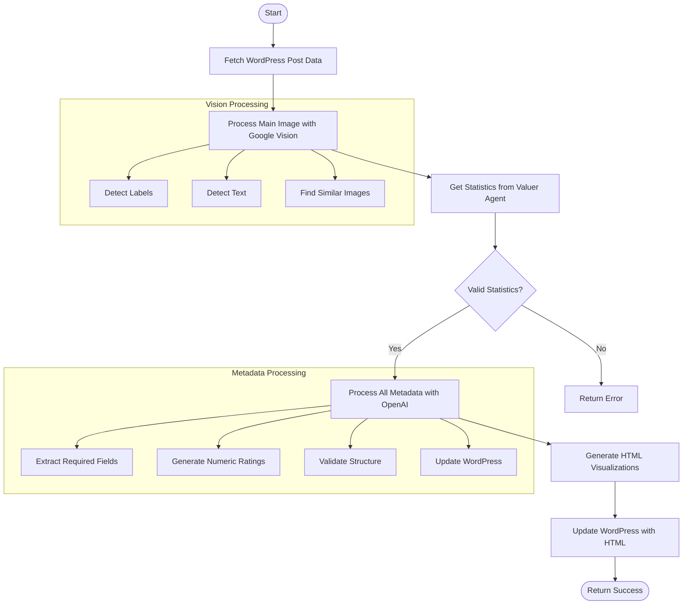
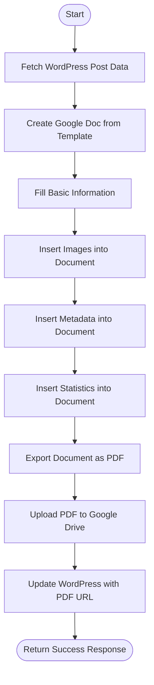
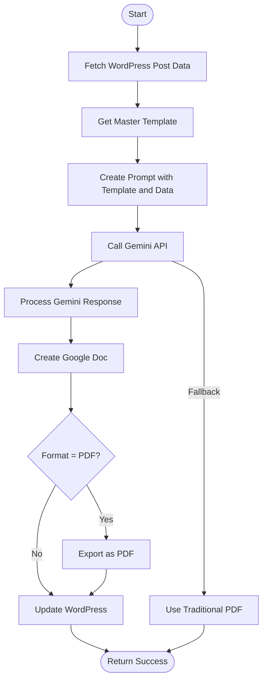
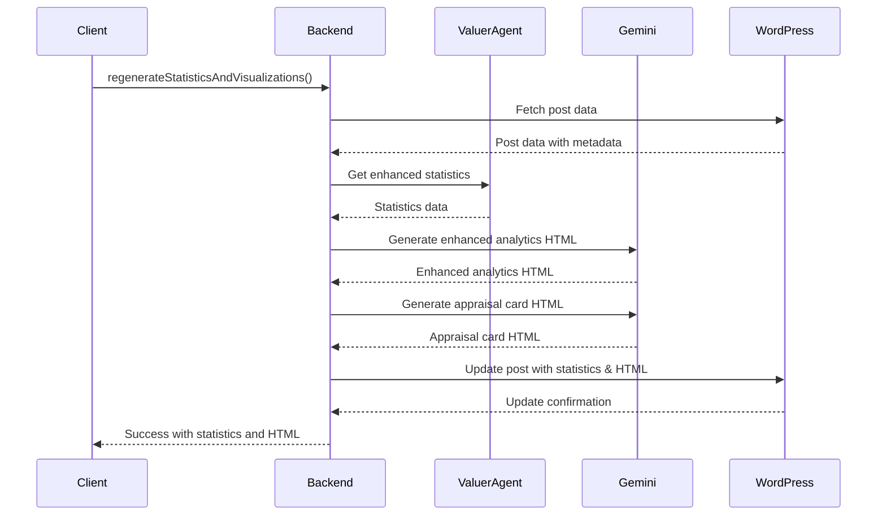

# Appraisals Backend

A specialized backend service for the APPRAISERS system that handles WordPress integration, OpenAI and Google Vision API interactions, PDF generation, and content analysis and enhancement for art appraisals.

## Table of Contents

- [Overview](#overview)
- [System Architecture](#system-architecture)
- [Core Functionality](#core-functionality)
- [File Structure](#file-structure)
- [API Endpoints](#api-endpoints)
- [Classes and Functions](#classes-and-functions)
- [Metadata Processing System](#metadata-processing-system)
- [Environment Variables and Secrets](#environment-variables-and-secrets)
- [Process Flows](#process-flows)
- [Dependencies](#dependencies)
- [Deployment](#deployment)
- [Development Setup](#development-setup)

## Overview

The Appraisals Backend is a Node.js Express application that provides specialized functionality for processing art appraisals, including:

- Integration with WordPress for content storage and retrieval
- Image analysis using Google Vision API
- Content enhancement via OpenAI and Google Gemini
- PDF report generation using Google Docs templates
- Visualization and statistics generation for appraisals
- Data processing and metadata management

## System Architecture

This service is part of the larger APPRAISERS system and primarily interacts with:

- WordPress CMS (for content storage)
- Google Cloud services (Secret Manager, Vision API, Docs/Drive)
- OpenAI API (for content enhancement)
- Google Gemini (for visualizations and advanced AI features)
- Valuer Agent service (for appraisal valuations)



## Core Functionality

### Report Generation
Handles the complete appraisal report generation process including image analysis, metadata processing, and statistics generation.

### PDF Generation
Creates professional PDF reports from appraisal data using Google Docs templates and the Google Drive API.

### Visualization Generation
Produces visual analytics and statistics for appraisals to support valuation justifications.

### Description Enhancement
Uses AI to enhance and improve appraisal descriptions.

### Content Processing
Processes images, extracts metadata, and enhances content quality.

### Metadata Processing
Extracts, analyzes, and enhances metadata for appraisals using AI-driven batch processing.

## File Structure

```
appraisals-backend/
├── index.js                        # Entry point and server initialization
├── config.js                       # Configuration management and secrets
├── Dockerfile                      # Container configuration for Cloud Run
├── service.yaml                    # Cloud Run service configuration
├── package.json                    # Dependencies and scripts
├── ROUTE_MAPPING.md                # API route documentation
├── STATISTICS_REGENERATION_PROCESS.md # Documentation for statistics process
├── APPRAISAL_PROCESS_DIAGRAM.md    # Detailed process flow documentation
│
├── routes/                         # API route handlers
│   ├── description.js              # Description enhancement endpoints
│   ├── html.js                     # HTML generation endpoints
│   ├── pdf.js                      # PDF generation endpoints (step-based)
│   ├── pdf-legacy.js               # Legacy PDF generation endpoints
│   ├── report.js                   # Appraisal report generation endpoints
│   ├── utility.js                  # Utility endpoints
│   └── visualizations.js           # Visualization generation endpoints
│   └── gemini-docs.js              # Gemini document generation endpoints
│
├── services/                       # Business logic components
│   ├── constants/                  # Shared constants
│   ├── gemini-docs.js              # Google Gemini for document generation
│   ├── gemini-visualization.js     # Google Gemini integration for visualizations
│   ├── geminiService.js            # Google Gemini API service
│   ├── metadataProcessor.js        # Legacy metadata processor (individual fields)
│   ├── metadataBatchProcessor.js   # Optimized metadata batch processor
│   ├── metadata/                   # Modular metadata processing system
│   │   ├── index.js                # Exports metadata processing functions
│   │   ├── processor.js            # Individual field processor implementations
│   │   └── batchProcessor.js       # Optimized batch processor implementation
│   ├── openai.js                   # OpenAI API service
│   ├── pdf/                        # PDF generation services
│   │   ├── index.js                # Main PDF service entry point
│   │   ├── documentGenerator.js    # Google Docs document generation
│   │   ├── pdfSteps.js             # Step-based PDF generation process
│   │   └── utils.js                # PDF utility functions
│   ├── regenerationService.js      # Statistics and visualization regeneration
│   ├── serper.js                   # Web search service
│   ├── utils/                      # Shared utility functions
│   │   ├── formatting.js           # Text and data formatting utilities
│   │   ├── imageProcessing.js      # Image processing helpers
│   │   └── validation.js           # Input validation utilities
│   ├── valuerAgentClient.js        # Client for valuer agent service
│   ├── vision.js                   # Google Vision API service
│   └── wordpress/                  # WordPress API integration
│       ├── index.js                # Main WordPress service
│       ├── mediaUtils.js           # Media handling utilities
│       └── postUtils.js            # Post management utilities
│
├── prompts/                        # AI prompt templates
│   └── consolidated_metadata.txt   # Prompt for batch metadata generation
├── build-scripts/                  # Build automation scripts
│   └── test-gemini-doc.js          # Gemini document generation test script
├── bundles/                        # Frontend bundles/assets
├── static/                         # Static assets
├── templates/                      # HTML and report templates
│   ├── skeletons/                  # HTML skeleton templates
│   └── partials/                   # Reusable template components
├── master-template.md              # Master template for Gemini document generation
└── css/                            # CSS stylesheets
```

## API Endpoints

### Health Check
- `GET /health` - Health check endpoint
  - Returns service status and timestamp indicating service availability
  - Response: `{ status: "ok", timestamp: "ISO timestamp" }`

### Report Generation Endpoints (`/`)
- `POST /complete-appraisal-report` - Generates a complete appraisal report
  - Parameters: `postId` (string/number), `justificationOnly` (boolean, optional), `detailedDescription` (string, optional)
  - Processes appraisal data through several steps: image analysis, statistics generation, metadata processing, and HTML visualization generation
  - Returns: JSON with success status and processing details
  - If `detailedDescription` is omitted, the backend will attempt to read the ACF field `detailed_title` (or `detailed_description`) from the WordPress post before falling back to the regular post title.

### Gemini Document Generation Endpoints (`/api/gemini-docs/`)
- `POST /api/gemini-docs/generate` - Generates a document using Google Gemini
  - Parameters: `postId` (string/number), `format` (string, 'docs' or 'pdf'), `test` (boolean)
  - Generates a formatted document using Google Gemini AI with fallback to traditional methods
  - Returns: JSON with document URL and PDF URL if requested
- `GET /api/gemini-docs/generate/:postId` - GET version of the document generation endpoint
  - Parameters: `:postId` (string/number), `format` (query, 'docs'/'pdf'), `test` (query, boolean)
  - Same functionality as the POST version

### Visualization Endpoints (`/api/visualizations/`)
- `GET /api/visualizations/debug` - Visualization debugging endpoint
  - Interactive debugging interface for visualization generation
- `POST /api/visualizations/regenerate` - Regenerates statistics and visualizations
  - Parameters: `postId` (string/number), `value` (number/string)
  - Regenerates statistics and visualizations for an appraisal
  - Returns: JSON with success status and generated data

### PDF Endpoints (`/api/pdf/`)
- `POST /api/pdf/generate-pdf` - Generates PDF document
  - Parameters: `postId` (string/number)
  - Generates a PDF report using Google Docs
  - Returns: JSON with success status and PDF URL
- `GET /api/pdf/generate-pdf/:postId` - GET version of PDF generation
  - Parameters: `:postId` (string/number)
  - Same functionality as the POST version
- `GET /api/pdf/steps` - Gets PDF generation steps
  - Returns the available steps in the PDF generation process
- `POST /api/pdf/generate-pdf-steps` - Step-by-step PDF generation
  - Parameters: `postId` (string/number), `startStep` (string, optional), `options` (object, optional)
  - Processes PDF generation step by step with detailed logging
  - Returns: JSON with success status, PDF URL, and step logs

### Legacy Endpoints
The following endpoints are maintained for backward compatibility:
- Legacy report endpoints via `/`
- Legacy PDF generation via `/api/pdf-legacy/`
- Legacy utility endpoints via `/`

### Description Endpoints (`/api/description/`)
- `POST /api/description/enhance-description` - Enhances appraisal descriptions using AI
  - Parameters: `postId` (string/number), `description` (string)
  - Uses OpenAI to enhance the appraisal description with additional details
  - Returns: JSON with success status and enhanced description

### HTML Endpoints (`/api/html/`)
- `POST /api/html/generate` - Generates HTML for a specific visualization type
  - Parameters: `postId` (string/number), `type` (string)
  - Generates HTML content for the specified visualization type
  - Returns: JSON with success status and HTML content
- `POST /api/html/process-statistics` - Processes statistics data and adds generated HTML
  - Parameters: `postId` (string/number), `statistics` (object)
  - Processes statistics data and updates the WordPress post with generated HTML
  - Returns: JSON with success status and processed data

### Utility Endpoints (`/api/utility/`)
- `POST /api/utility/decode-html-entities` - Decodes HTML entities in text
  - Parameters: `content` (string)
  - Decodes HTML entities in the provided content
  - Returns: JSON with decoded content
- `GET /api/utility/health` - Health check endpoint
  - Returns the service status and version

## Classes and Functions

### Core Application Classes

#### Server Initialization (`index.js`)
- **Functions:**
  - `startServer()` - Initializes and starts the Express server
  - `loadSecrets()` - Loads secrets from Google Secret Manager
  - `getSecret(secretName)` - Fetches a specific secret from Secret Manager

#### Configuration (`config.js`)
- **Class/Object:**
  - `config` - Configuration object with environment variables and settings
- **Methods:**
  - `getSecret(secretName)` - Fetches a secret from Secret Manager
  - `initSecrets()` - Initializes all required secrets for the application

### WordPress Integration

#### WordPress Service (`services/wordpress/index.js`)
- **Functions:**
  - `fetchPostData(postId)` - Fetches post data from WordPress
  - `updatePost(postId, data)` - Updates a WordPress post
  - `updatePostMeta(postId, metaFields)` - Updates multiple post metadata fields at once
  - `uploadMedia(buffer, filename)` - Uploads media to WordPress
  - `getAuthHeaders()` - Gets authentication headers for WordPress API

#### WordPress Media Utilities (`services/wordpress/mediaUtils.js`)
- **Functions:**
  - `uploadMediaToWordPress(buffer, filename, mimeType)` - Uploads media to WordPress
  - `downloadImage(url)` - Downloads an image from a URL
  - `getMediaDetails(mediaId)` - Gets details about a media item

#### WordPress Post Utilities (`services/wordpress/postUtils.js`)
- **Functions:**
  - `fetchPost(postId)` - Fetches a post by ID
  - `updatePostContent(postId, content)` - Updates post content
  - `getPostMetafields(postId)` - Gets all meta fields for a post
  - `updatePostMetafields(postId, fields)` - Updates meta fields for a post

### AI Services

#### OpenAI Service (`services/openai.js`)
- **Functions:**
  - `generateContent(prompt, postTitle, images, model, systemMessage, maxTokens, temperature)` - Generates text content
  - `generateStructuredMetadata(postTitle, postData, images, statistics)` - Generates structured metadata using a single API call
  - `buildMessageContent(prompt, imageUrl)` - Helper to build message content with text and images
  - `initOpenAIClient()` - Initializes the OpenAI client

#### Gemini Service (`services/geminiService.js`)
- **Functions:**
  - `initializeGeminiClient()` - Initializes the Google Gemini client
  - `generateContentWithGemini(prompt, images)` - Generates content with Gemini API
  - `analyzeImages(imageUrls, promptText)` - Analyzes images with multimodal AI

#### Gemini Visualization (`services/gemini-visualization.js`)
- **Functions:**
  - `generateVisualization(data, visualizationType)` - Generates a visualization using Gemini
  - `generateAppraisalCardHtml(statistics, metadata)` - Generates appraisal card HTML
  - `generateEnhancedAnalyticsHtml(statistics, metadata)` - Generates enhanced analytics HTML

#### Gemini Document Generation (`services/gemini-docs.js`)
- **Class:** GeminiDocsService
- **Methods:**
  - `initialize()` - Initializes the Gemini service
  - `getTemplate()` - Gets the master template content
  - `createPrompt(template, data)` - Creates a formatted prompt for Gemini
  - `generateDocFromWordPressPost(postId, wordpressService, options)` - Generates document from WordPress post
  - `createGoogleDocFromMarkdown(markdown, filename)` - Creates a Google Doc from markdown
  - `exportAsPdf(docId, filename)` - Exports the document as PDF
  - `updateWordPressWithLinks(postId, docUrl, pdfUrl)` - Updates WordPress with document links

### Image Processing

#### Vision Service (`services/vision.js`)
- **Functions:**
  - `initializeVisionClient()` - Initializes the Google Vision client
  - `processMainImageWithGoogleVision(postId)` - Processes an image with Google Vision
  - `analyzeSimilarImages(imageUrl)` - Finds similar images using Vision API
  - `detectLabels(imageUrl)` - Detects objects and labels in an image
  - `detectTextInImage(imageUrl)` - Extracts text from an image
  - `analyzeImage(imageUrl)` - Performs comprehensive image analysis

#### Image Processing Utilities (`services/utils/imageProcessing.js`)
- **Functions:**
  - `resizeImage(buffer, maxWidth, maxHeight)` - Resizes an image
  - `convertToWebP(buffer)` - Converts an image to WebP format
  - `extractEXIFData(buffer)` - Extracts EXIF data from an image
  - `getImageDimensions(buffer)` - Gets image dimensions

### Metadata Processing

#### Metadata Batch Processor (`services/metadataBatchProcessor.js`)
- **Functions:**
  - `processBatchMetadata(postId, postTitle, postData, images, statistics)` - Processes all metadata in one API call
  - `validateMetadataStructure(metadata)` - Validates metadata structure
  - `updateWordPressWithMetadata(postId, metadata)` - Updates WordPress with processed metadata

#### Legacy Metadata Processor (`services/metadataProcessor.js`)
- **Functions:**
  - `processAllMetadata(postId, postTitle, data)` - Legacy metadata processing
  - `processJustificationMetadata(postId, postTitle, value)` - Processes justification data
  - `processProvenanceField(postId, provenanceText)` - Processes provenance data
  - `processMediumField(postId, mediumText)` - Processes medium data
  - `processConditionField(postId, conditionText)` - Processes condition data

### PDF Generation

#### PDF Service (`services/pdf/index.js`)
- **Functions:**
  - `initializeGoogleApis()` - Initializes Google APIs for PDF generation
  - `cloneTemplate(templateId)` - Clones a Google Docs template
  - `getTemplateId(appraisalType)` - Gets the template ID for an appraisal type
  - `moveFileToFolder(fileId, folderId)` - Moves a file to a Google Drive folder
  - `replacePlaceholdersInDocument(documentId, data)` - Replaces placeholders in a document
  - `adjustTitleFontSize(documentId, titleText)` - Adjusts the font size of the title
  - `insertImageAtPlaceholder(documentId, placeholder, imageUrl)` - Inserts an image at a placeholder
  - `addGalleryImages(documentId, gallery)` - Adds gallery images to a document
  - `exportToPDF(documentId)` - Exports a document as PDF
  - `uploadPDFToDrive(pdfBuffer, filename, folderId)` - Uploads a PDF to Google Drive

#### PDF Steps (`services/pdf/pdf-steps.js`)
- **Object:**
  - `PDF_STEPS` - Steps in the PDF generation process
- **Steps:**
  - `FETCH_POST_DATA` - Fetches post data from WordPress
  - `PROCESS_METADATA` - Processes metadata
  - `GET_TEMPLATE` - Gets the template ID
  - `CLONE_TEMPLATE` - Clones the template
  - `MOVE_TO_FOLDER` - Moves the document to a folder
  - `REPLACE_PLACEHOLDERS` - Replaces placeholders in the document
  - `ADJUST_TITLE` - Adjusts the title font size
  - `OPTIMIZE_IMAGES` - Optimizes images
  - `INSERT_MAIN_IMAGE` - Inserts the main image
  - `INSERT_GALLERY` - Inserts the gallery
  - `INSERT_SPECIFIC_IMAGES` - Inserts specific images
  - `EXPORT_PDF` - Exports the document as PDF
  - `UPLOAD_PDF` - Uploads the PDF to Google Drive
  - `UPDATE_WORDPRESS` - Updates WordPress with the PDF URL

### Statistics and Visualization

#### Regeneration Service (`services/regenerationService.js`)
- **Functions:**
  - `regenerateStatisticsAndVisualizations(postId, newValue, options)` - Regenerates statistics and visualizations
  - `processStatisticsData(postId, statistics)` - Processes statistics data
  - `generateHtml(postId, type, data)` - Generates HTML for visualizations

#### Valuer Agent Client (`services/valuerAgentClient.js`)
- **Functions:**
  - `getEnhancedStatistics(metadata, value)` - Gets enhanced statistics from Valuer Agent
  - `fetchValuationStatistics(postId, value)` - Fetches valuation statistics
  - `verifyStatisticsData(statistics)` - Verifies statistics data structure

### Utility Functions

#### Formatting Utils (`services/utils/formatting.js`)
- **Functions:**
  - `formatCurrency(value)` - Formats a value as currency
  - `formatDate(date)` - Formats a date
  - `sanitizeHtml(html)` - Sanitizes HTML content
  - `decodeHtmlEntities(text)` - Decodes HTML entities

#### Validation Utils (`services/utils/validation.js`)
- **Functions:**
  - `validatePostId(postId)` - Validates a post ID
  - `validateImageUrl(url)` - Validates an image URL
  - `validateStatistics(statistics)` - Validates statistics data
  - `isValidJson(str)` - Checks if a string is valid JSON

### Web Search Service (`services/serper.js`)
- **Functions:**
  - `searchWeb(query, numResults)` - Searches the web using Serper API
  - `searchImages(query, numResults)` - Searches for images
  - `searchNews(query, numResults)` - Searches for news articles

## Metadata Processing System

The metadata processing system has been optimized to use a single AI call instead of multiple calls for different fields. This reduces API costs and improves performance.

### Metadata Batch Processor

#### Root Implementation (`services/metadataBatchProcessor.js`)
- `processBatchMetadata(postId, postTitle, postData, images, statistics)` - Main entry point for batch metadata processing
  - Makes a single OpenAI call with all available data
  - Processes and validates the response
  - Efficiently updates WordPress with all metadata at once
- `validateMetadataStructure(metadata)` - Validates that the metadata structure has all required fields

#### Modular Implementation (`services/metadata/batchProcessor.js`)
- Same functionality as the root implementation but located in a modular structure
- Used for importing via the metadata module index

#### Metadata Index (`services/metadata/index.js`)
- Exports both legacy individual field processors and the new batch processor
- Provides a clean transition from the old system to the new system

### Legacy Individual Processors (`services/metadata/processor.js`)
- `processAllMetadata(postId, postTitle, data)` - Legacy stub for processing all metadata
- `processJustificationMetadata(postId, postTitle, value)` - Processes only justification data
- `processProvenanceField(postId, provenanceText)` - Processes only provenance data
- `processMediumField(postId, mediumText)` - Processes only medium data
- `processConditionField(postId, conditionText)` - Processes only condition data

### Metadata Fields

The system processes the following metadata fields:

**Required Fields:**
- `creator` - The artist/maker of the item
- `medium` - Materials and techniques used
- `object_type` - Type of object (painting, sculpture, etc.)
- `condition_summary` - Summary of the item's condition
- `estimated_age` - Estimated age or period of creation

**Numeric Fields:**
- `condition_score` - Numerical rating of the item's condition (1-10)
- `rarity` - Numerical rating of the item's rarity (1-10)
- `market_demand` - Numerical rating of market demand (1-10)
- `historical_significance` - Numerical rating of historical importance (1-10)
- `investment_potential` - Numerical rating of investment potential (1-10)
- `provenance_strength` - Numerical rating of provenance quality (1-10)

**Additional Fields:**
- `signed` - Whether the item is signed
- `framed` - Whether the item is framed
- `provenance` - History of ownership
- `dimensions` - Physical dimensions
- `coa` - Certificate of authenticity information
- and others specific to the type of item

### Metadata Processing Flow



## Environment Variables and Secrets

The application uses Google Cloud Secret Manager for secure credential storage in production and environment variables for local development.

### Required Secrets (in Secret Manager)
- `wp_username` - WordPress API username
- `wp_app_password` - WordPress API application password
- `WORDPRESS_API_URL` - WordPress API URL
- `OPENAI_API_KEY` - OpenAI API key
- `GOOGLE_VISION_CREDENTIALS` - Google Vision API credentials (JSON)
- `GEMINI_API_KEY` - Google Gemini API key
- `GOOGLE_DOCS_CREDENTIALS` - Google Docs API credentials (JSON)
- `SERPER_API` - Optional Serper API key for web search

### Environment Variables
- `PORT` - Server port (default: 8080)
- `NODE_ENV` - Environment mode (development/production)
- `GOOGLE_CLOUD_PROJECT_ID` - Google Cloud project ID
- `CORS_ALLOWED_ORIGINS` - Comma-separated list of allowed CORS origins
- `SKIP_SECRET_MANAGER` - Set to 'true' to use env vars directly (for local dev)
- `GOOGLE_DOCS_TEMPLATE_ID` - ID of the Google Docs template
- `GOOGLE_DRIVE_FOLDER_ID` - ID of the Google Drive folder for PDF storage
- `VALUER_AGENT_API_URL` - URL of the Valuer Agent service

## Process Flows

### Complete Appraisal Report Generation



### Step-Based PDF Generation Process



### Gemini Document Generation Process



### Statistics and Visualization Generation



## Dependencies

Main dependencies include:

```json
{
  "dependencies": {
    "@google-cloud/secret-manager": "^3.0.0",
    "@google-cloud/vision": "^4.0.0",
    "@google/generative-ai": "^0.24.0",
    "commander": "^11.0.0",
    "cors": "^2.8.5",
    "cross-env": "^7.0.3",
    "date-fns": "^2.29.3",
    "dotenv": "^16.5.0",
    "express": "^4.18.2",
    "form-data": "^4.0.0",
    "googleapis": "^105.0.0",
    "handlebars": "^4.7.7",
    "he": "^1.2.0",
    "image-size": "^1.0.2",
    "node-fetch": "^2.6.7",
    "openai": "4.97.0",
    "request-ip": "^3.3.0",
    "uuid": "^9.0.0"
  }
}
```

## Deployment

The service is deployed as a containerized application on Google Cloud Run using the included Dockerfile and service.yaml configuration.

### Dockerfile
```dockerfile
# Use Node.js LTS version
FROM node:18-slim

# Set working directory
WORKDIR /usr/src/app

# Copy package files first (for better layer caching)
COPY package*.json ./

# Install dependencies with production-only flag
RUN npm ci --only=production

# Copy the rest of the application
COPY . .

# Create a non-root user for security
RUN groupadd -r appuser && \
    useradd -r -g appuser -d /usr/src/app appuser && \
    chown -R appuser:appuser /usr/src/app

# Switch to non-root user
USER appuser

# Expose the port
EXPOSE 8080

# Command to run the app
CMD [ "npm", "start" ]
```

### Cloud Run Configuration (`service.yaml`)
```yaml
apiVersion: serving.knative.dev/v1
kind: Service
metadata:
  name: appraisals-backend
  namespace: civil-forge-403609
spec:
  template:
    spec:
      containers:
        - image: gcr.io/civil-forge-403609/appraisals-backend
          ports:
            - containerPort: 8080
          env:
            - name: GOOGLE_CLOUD_PROJECT_ID
              value: civil-forge-403609
            - name: CORS_ALLOWED_ORIGINS
              value: "https://appraisily.com,https://app.appraisily.com,https://dev.appraisily.com"
          resources:
            limits:
              cpu: "2"
              memory: "2Gi"
            requests:
              cpu: "1"
              memory: "1Gi"
          serviceAccountName: appraisals-backend-sa
```

### Deployment Process

The application is deployed through GitHub to Google Cloud Run. The deployment process uses the following steps:

1. Code is pushed to the GitHub repository
2. GitHub Actions workflow is triggered
3. The application is built using the Dockerfile
4. The container image is pushed to Google Container Registry
5. The Cloud Run service is updated with the new image
6. Secrets are accessed via the service account specified in service.yaml

Since deployment is done through GitHub, environment variables are configured in Runtime Variables inside the Cloud Run service rather than using .env files. Secrets are stored in Google Secret Manager and accessed by the application at runtime.

## Development Setup

1. Clone the repository
2. Install dependencies:
   ```bash
   npm install
   ```
3. Create a `.env` file with required environment variables:
   ```
   SKIP_SECRET_MANAGER=true
   WORDPRESS_API_URL=https://your-wordpress-site.com/wp-json
   wp_username=your_wordpress_username
   wp_app_password=your_wordpress_app_password
   OPENAI_API_KEY=your_openai_api_key
   GEMINI_API_KEY=your_gemini_api_key
   GOOGLE_CLOUD_PROJECT_ID=your_gcp_project_id
   CORS_ALLOWED_ORIGINS=http://localhost:3000,http://localhost:5173
   ```
4. Start the development server:

   For local development with Secret Manager skipped:
   ```bash
   npm run start:local
   ```

   Or for standard startup:
   ```bash
   npm start
   ```

For local development, set `SKIP_SECRET_MANAGER=true` in your `.env` file to use the environment variables directly instead of trying to access Secret Manager.

### Running Tests

```bash
npm run lint
```

### Testing Gemini Document Generation

```bash
npm run test-gemini-doc -- --post-id <id> --format pdf --output test.pdf
```

## Routes Documentation

For detailed route mapping information, refer to [ROUTE_MAPPING.md](./ROUTE_MAPPING.md).

## Statistics Regeneration Process

For details on how statistics regeneration works, refer to [STATISTICS_REGENERATION_PROCESS.md](./STATISTICS_REGENERATION_PROCESS.md).

## Appraisal Process Diagram

For a complete visual representation of the appraisal process, refer to [APPRAISAL_PROCESS_DIAGRAM.md](./APPRAISAL_PROCESS_DIAGRAM.md).