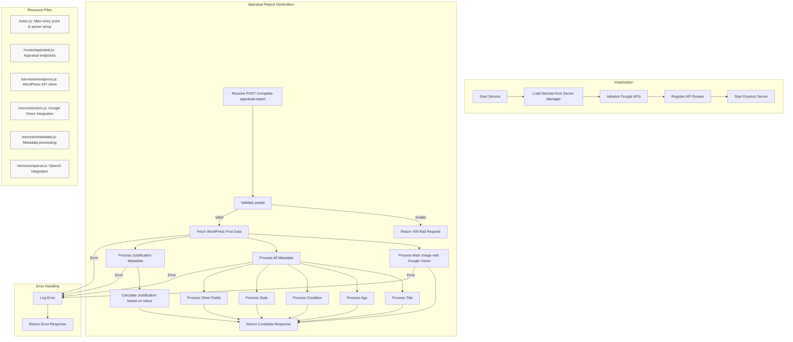
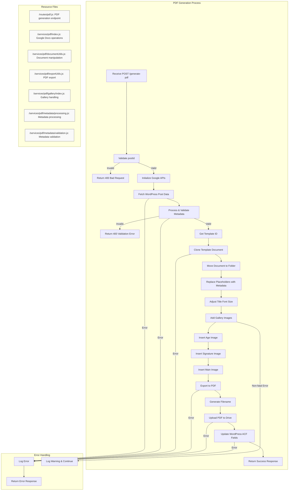

# Appraisals Backend Service

A scalable, serverless API service built with Node.js that automates the generation of professional art appraisal reports using AI vision analysis and natural language processing.

---

## Table of Contents

- [Overview](#overview)
- [Features](#features)
- [Architecture](#architecture)
- [Requirements](#requirements)
- [Installation](#installation)
- [Configuration](#configuration)
- [Deployment](#deployment)
- [Usage](#usage)
- [Testing](#testing)
- [CI/CD Integration](#cicd-integration)
- [Troubleshooting](#troubleshooting)
- [Contributing](#contributing)
- [License](#license)

---

## Overview

- **Purpose:** Automates the creation of comprehensive art appraisal reports by analyzing artwork images and generating expert descriptions.
- **Scope:** Handles image analysis, content generation, and PDF report creation for art appraisals.
- **Tech Stack:**
  - Node.js
  - Express.js
  - Google Cloud Run
  - Google Vision AI
  - OpenAI GPT-4
  - Google Docs/Drive APIs
  - WordPress REST API

---

## Features

- Automated image analysis using Google Vision AI
- Similar artwork detection and comparison
- Expert content generation using GPT-4
- Automated PDF report generation
- WordPress integration for content management
- Secure credential handling via Google Secret Manager
- Scalable serverless architecture
- Real-time processing and updates
- Professional PDF report formatting
- Comprehensive error handling and logging

---

## Architecture

### Components

- **API Layer:** Express.js REST API
- **Image Analysis:** Google Vision AI
- **Content Generation:** OpenAI GPT-4
- **Document Processing:** Google Docs/Drive APIs
- **Content Storage:** WordPress REST API
- **Secret Management:** Google Cloud Secret Manager

### Flow

1. Client submits appraisal request with artwork images
2. System analyzes images using Google Vision AI
3. GPT-4 generates expert descriptions and analysis
4. Content is stored in WordPress
5. PDF report is generated using Google Docs
6. Final report is uploaded to Google Drive
7. Links are returned to the client

### Detailed Process Flow Diagrams

#### Appraisal Report Generation Flow



#### PDF Generation Flow



---

## Requirements

### Google Cloud Platform
- Active GCP Account
- Cloud Run enabled
- Secret Manager configured
- Vision AI API enabled
- Cloud Storage configured

### APIs and Services
- OpenAI API access
- WordPress installation with REST API
- Google Docs API access
- Google Drive API access

### Development Environment
- Node.js 18+
- npm or yarn
- Docker (for containerization)
- Google Cloud SDK

---

## Installation

1. **Clone the Repository:**
   ```bash
   git clone [repository-url]
   cd appraisals-backend
   ```

2. **Install Dependencies:**
   ```bash
   npm install
   ```

3. **Set Up Environment Variables:**
   ```bash
   # Create .env file with required variables
   cp .env.example .env
   ```

---

## Configuration

### Environment Variables

Required secrets in Google Cloud Secret Manager:
- `WORDPRESS_API_URL`: WordPress REST API endpoint
- `wp_username`: WordPress username
- `wp_app_password`: WordPress application password
- `OPENAI_API_KEY`: OpenAI API key
- `GOOGLE_VISION_CREDENTIALS`: Google Vision AI credentials
- `GOOGLE_DOCS_CREDENTIALS`: Google Docs API credentials

Additional variables:
- `GOOGLE_DOCS_TEMPLATE_ID`: Template document ID
- `GOOGLE_DRIVE_FOLDER_ID`: Output folder ID
- `PORT`: Server port (default: 8080)

### WordPress Configuration

Required ACF fields:
- `main`: Main artwork image
- `age`: Age-related image
- `signature`: Signature image
- `googlevision`: Gallery field for similar images
- Various text fields for metadata

---

## Deployment

1. **Build the Container:**
   ```bash
   docker build -t gcr.io/[PROJECT_ID]/appraisals-backend .
   ```

2. **Push to Container Registry:**
   ```bash
   docker push gcr.io/[PROJECT_ID]/appraisals-backend
   ```

3. **Deploy to Cloud Run:**
   ```bash
   gcloud run deploy appraisals-backend \
     --image gcr.io/[PROJECT_ID]/appraisals-backend \
     --platform managed \
     --region [REGION] \
     --allow-unauthenticated
   ```

---

## Usage

### Complete Appraisal Report

```bash
curl -X POST https://[SERVICE_URL]/complete-appraisal-report \
  -H "Content-Type: application/json" \
  -d '{"postId": "YOUR_POST_ID"}'
```

### Generate PDF Report

```bash
curl -X POST https://[SERVICE_URL]/generate-pdf \
  -H "Content-Type: application/json" \
  -d '{
    "postId": "YOUR_POST_ID",
    "session_ID": "OPTIONAL_SESSION_ID"
  }'
```

---

## Testing

```bash
# Run tests
npm test

# Test specific endpoints
curl -X POST https://[SERVICE_URL]/complete-appraisal-report \
  -H "Content-Type: application/json" \
  -d '{"postId": "TEST_POST_ID"}'
```

---

## CI/CD Integration

The service uses Google Cloud Build for continuous integration and deployment:

1. Automated testing on pull requests
2. Container building and pushing
3. Deployment to Cloud Run
4. Post-deployment verification

---

## Troubleshooting

Common issues and solutions:

1. **WordPress Connection Issues:**
   - Check API credentials
   - Verify CORS settings
   - Test network connectivity

2. **Vision AI Errors:**
   - Verify API credentials
   - Check image format and size
   - Review quota limits

3. **PDF Generation Issues:**
   - Verify template document access
   - Check Google Drive permissions
   - Review image dimensions

---

## Contributing

1. Fork the repository
2. Create a feature branch
3. Commit your changes
4. Push to the branch
5. Create a Pull Request

---

## License

MIT License - See LICENSE file for details